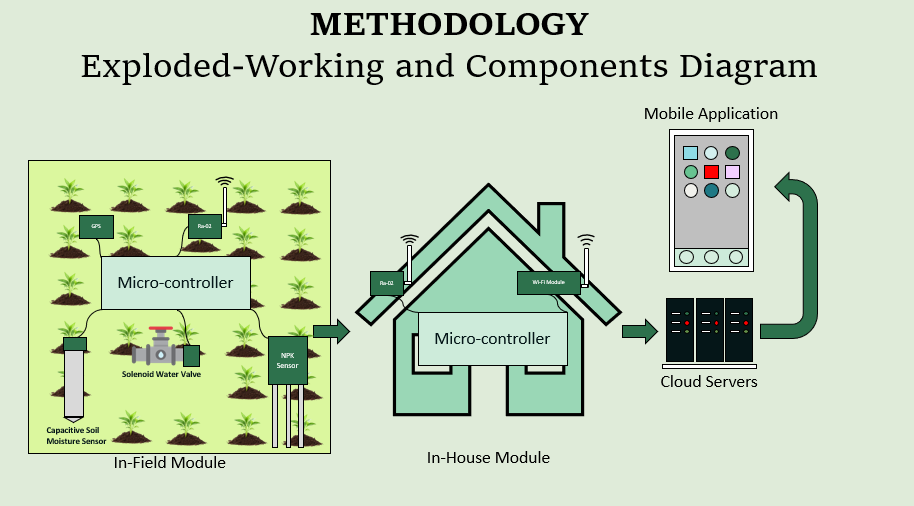
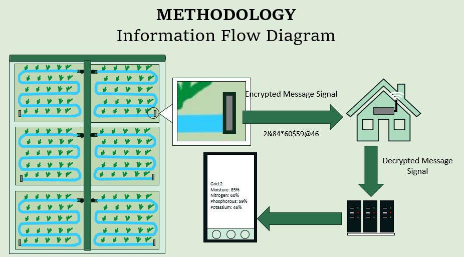

# Smart AquaGrid

## Team KURO

Smart AquaGrid is a **LoRa-aided grid irrigation and control system** designed to optimize water usage in precision farming. It reduces water waste by monitoring soil and environmental conditions. A mobile app provides **real-time data and management insights** for better crop management and future planning.

---

## 🚨 Problem Statement

Traditional irrigation methods lead to:
- ❌ Uneven water distribution
- ❌ Lack of real-time monitoring
- ❌ Absence of soil condition tracking

## ✅ Our Approach

✔️ Farmland is divided into multiple grids based on farmers' needs.
✔️ Each grid has **sensors** to monitor key environmental and soil conditions (moisture, nutrients, etc.).
✔️ Data is transmitted via **LoRa** technology to an online server, accessible via a **mobile application**.
✔️ When sensors detect a need for irrigation, the system automatically activates **water flow** in specific grids.
✔️ Prevents **over-irrigation** and **water wastage** while ensuring efficient resource management.

---

## 🌟 Features

- 📡 **Real-time soil and environmental monitoring**
- 🚰 **Automated irrigation control** based on soil data
- 📊 **Historical data analysis** for crop planning
- 📱 **Mobile app integration** for visualization and remote management

### 📲 App Capabilities

- ✅ Displays **current grid status**
- 🔄 Recommends **crop rotation** based on past data
- 🌱 Estimates **plant life cycle** and **optimal harvesting time**
- 💧 Auto-fills **irrigation requirements** based on plant type

---

## 🔧 Technologies Utilized

### **🛠 Hardware**
- ESP-32
- Raspberry Pi
- NPK Sensor
- Soil Moisture Sensor
- Ra-02 LoRa Module
- GPS Module
- Solenoid Valve
- Li-ion Batteries

### **💻 Programming Languages**
- C/C++
- Python
- Java/Kotlin
- Swift
- Verilog/VHDL
- HTML/CSS

### **🖥 Software & Tools**
- React, Flutter
- Google Cloud, GitHub
- MATLAB, Arduino IDE
- SolidWorks, Xilinx/Altera, Altium/OrCAD

---

## 📊 Feasibility

- 💰 **Cost-effective**: Approx. Rs. 6,500 per grid
- 📈 **Scalable**: Can be deployed in small or large farms
- 🛠 **Customizable**: Adaptable to different crop types and field sizes
- 🌍 **Market Fit**: Addresses **water scarcity** issues in agriculture